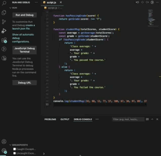

#GRADE BOOK APP

The application was built as a challenge project for a JavaScript Algorithms and Data Structures course with FreeCodeCamp. It features an app that can grade students based on their scores. Developed with HTML, CSS, and JavaScript, the app contains fundamental concepts from JavaScript like functions, variables, and conditionals.

## Features

- Function to get average of scores;
- Function that attributes a grade to scores within specific ranges;
- Function to show messages if students have passed or have failed their courses.

## Technologies

- HTML
- CSS
- JavaScript

## Start the App

In the project directory, open your terminal.

1. Open the Debug Console tab.
2. Run and debug the code to display the resulting pyramid.
3. Modify the values at the last line(`console.log`) using the sutdents scores throughout their courses.
4. Run the debug session again to see the updated message.

### Author

[Tanimara Elias Santos](https://github.com/tanimaraeliassantos)

### Version

1.0.0
